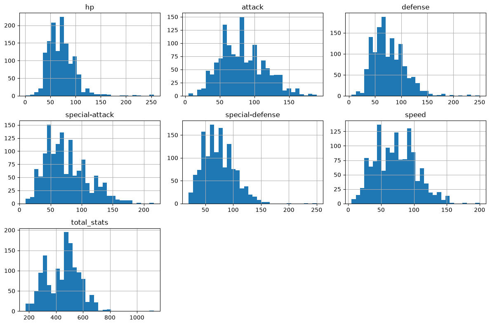
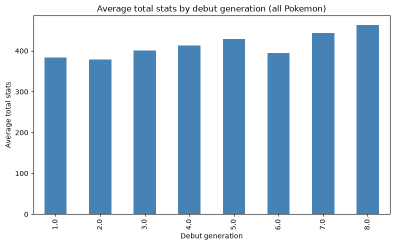

# Pokemon Data Analysis

Exploratory analysis of the Pokemon dataset pulled by [`pokemon-api-fetch`](../pokemon-api-fetch).

Open `Pokemon_Data_Analysis.ipynb` for stat distributions, type breakdowns, a
legendary/mythical/baby comparison, movepool analysis, and game-version availability.





## Setup

```
python3 -m venv .venv
.venv/bin/pip install pandas numpy matplotlib jupyter nbconvert ipykernel
```
